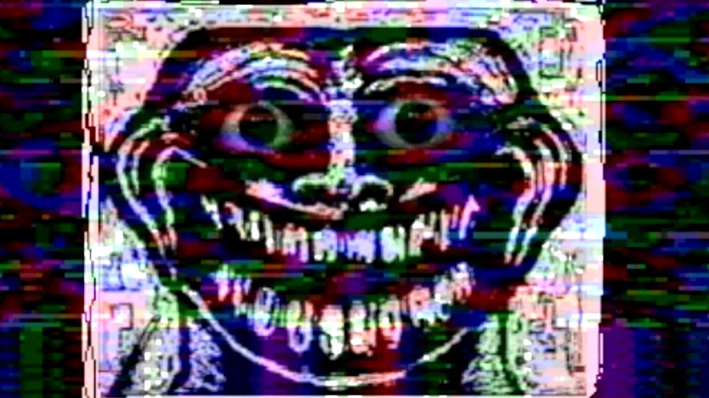

# *NAGLOWEK DDL*

tutaj sobie gadam
tu tez

**a tu juz nowy paragraficzi**
*tu jeszcze nie*

tu juz tak  
~~jednak nie~~

a jednak tak :)

paulo coelho

>"Kocha sie za nic. Nie istnieje zaden powod do milosci"
=============================================================

tutaj szybka listeczka rzeczy ktore kocham

1. stepik
    - stepik prowadzi mnie przez zycie
2. informatyka praktyczna
    - mama mowila wylacz komputer a teraz to ja sie smieje
3. uniwersytet gdanski
    - fajny park jest i budynek tez ale drzwi dziwne

===========================================================

tutaj tez lista ale taka bez numerkow, z moimi ulubionymi zwierzatkami

- kotki
    -slodkie fajne
- pieski
    -tez urocze
- wszystkie
    -wszystkie sa fajne, jedne smaczne, drugie mozna poglaskac

# naglowek RPK

tutaj kodzik programu bedzie

```py
a = 1
b = 3
mnozenie = a * b
print("wynik mnozenia to ", mnozenie)
```

fragment witania sie ze swiatme `print("hello world!")`




# hello {#ident1}  [^1]

| problem1 | problem2 | problem 3 |
|:---:            | :---:          |:---:             |
| opis          | opis          |   opis         |

.


.
.
.

# pytonik dodawanie {#ident2} [^2]
```py
x = 1
y = 2
z = x + y
print("X + Y =", z)
```

[powrot do przywitania](#ident1)  
[powrot do kodu](#ident2)  
[^1]: witam

[^2]: programista

aaaa

#zadania do wykonania
- [ ] lepiej sie uczyc
- [ ] ciezko pracowac
- [ ] zdac semestr

pozdrawiam serdecznie :sunglasses: :thumbsup:
